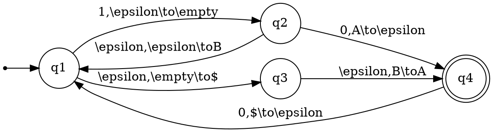
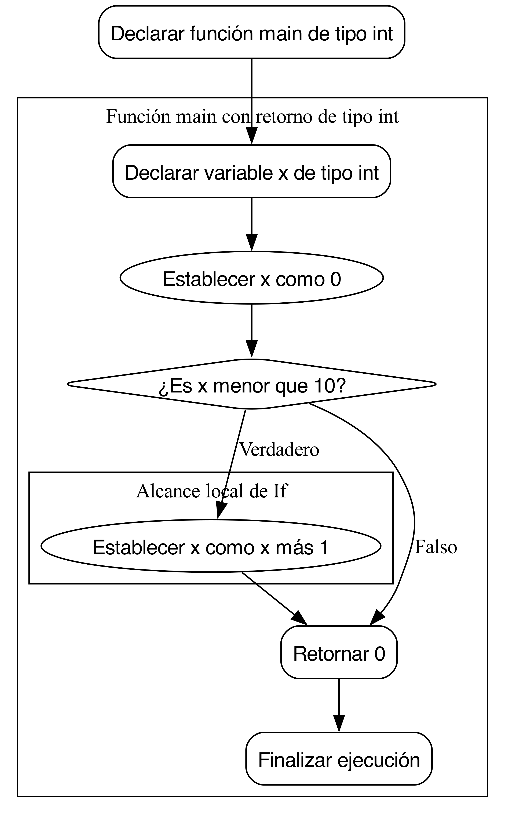

# Automaton Automator

This Visual Studio Code extension allows working with `.auto` files to visualize automata using Graphviz. It also experimentally supports generating flowcharts from programs written in C, COBOL, and pseudocode.

## Features

- Real-time preview of DOT/Graphviz diagrams
- Special focus on automata
- Command to copy as PNG
- Syntax highlighting for `.auto` and `.dot` files
- Experimental support for Program Chart Designer (flowcharts from C, COBOL, and pseudocode)
- Graphviz included within the extension

## Requirements

- Visual Studio Code 1.60.0 or higher
- The Graphviz `dot` binary is included in the extension; no separate installation required

## Usage

1. Install the extension  
2. Create or open a file with the `.auto` extension, or open files with `.c`, `.cbl`, `.cobol`, `.pse`, or `.pseudo` extensions  
3. The extension will automatically display a preview of the diagram, converting supported source files into flowcharts  
4. Use the context menu or command palette for "Copy as PNG"

## Example of a .auto file




## Example of a flowchart generated from C

For a C file (`example.c`):

```c
int main() {
    int x = 0;
    if (x < 10) {
        x = x + 1;
    }
    return 0;
}
```

