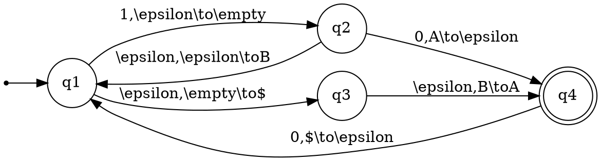

# Automaton Automator

This Visual Studio Code extension allows working with `.auto` files to visualize automata using Graphviz.

## Features

- Real-time preview of DOT/Graphviz diagrams
- Special focus on automata
- Command to copy as PNG
- Syntax highlighting for `.auto` and `.dot` files

## Requirements

- Visual Studio Code 1.60.0 or higher
- Graphviz installed on the system (the `dot` command available in the PATH)

## Usage

1. Install the extension
2. Create or open a file with the `.auto` extension
3. The extension will automatically display a preview of the diagram
4. Use the context menu or command palette for "Copy as PNG"

## Example of a .auto file

